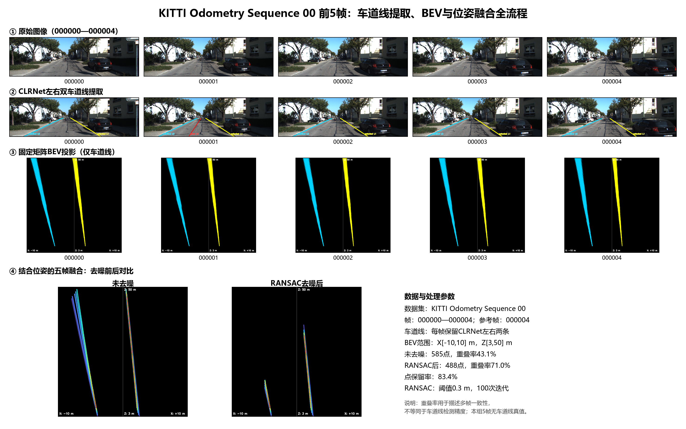

# KITTI Sequence 00 前5帧双车道线 BEV 位姿融合结果

本目录按完整处理顺序保存 5 张原始图、5 张 CLRNet 双车道线提取图、5 张固定矩阵 BEV、5 张位姿对齐 BEV，以及 RANSAC 去噪前后的五帧融合结果。

## 目录

- `01_original_frames/`：KITTI Odometry Sequence 00 的 `000000`—`000004` 原始左彩色相机图像。
- `02_lane_detection/`：CLRNet 检测结果；每帧保留左右两条车道线。
- `03_bev_projection/`：只对两条车道线掩膜做固定单应矩阵 BEV 投影。
- `04_pose_aligned_bev/`：利用 `poses/00.txt` 将各帧车道线对齐到参考帧 `000004`。
- `05_fusion/`：未去噪、RANSAC 去噪后，以及两者并排对比图。
- `06_overview/`：原图—检测—BEV—融合的单张总对比图。
- `metadata/`：Sequence 00 相机标定与本次使用的前 5 帧位姿。
- `audit/`：数据来源、参数、逐帧点数、指标和全部文件 SHA-256。

## 数据与方法

- 数据集：KITTI Odometry Sequence 00，帧 `000000`—`000004`。
- 图像来源：对应原始记录 `2011_10_03_drive_0027_sync/image_02/data`；5 张图均已按 SHA-256 验证为官方原图。
- 检测器：CLRNet，`configs/clrnet/clr_resnet18_culane.py`，权重 `weights/culane_r18.pth`。
- 车道线选择：按图像底部横坐标排序，保留最左和最右两条 CLRNet 折线。帧 `000001` 检出 3 个候选，其中额外中间候选在 BEV 前排除。
- BEV：`800×800 px`，横向 `X∈[-10,10] m`，前向 `Z∈[3,50] m`。
- 固定 IPM 参数：相机高度 `1.65 m`、俯仰角 `0°`。这两个值是当前实验假设，不是 Sequence 00 的逐帧路面外参真值。
- 位姿对齐：`p_ref = inv(T_w_ref) @ T_w_i @ p_i`，参考帧为 `000004`。
- 时间权重：`[0.2, 0.4, 0.6, 0.8, 1.0]`。
- RANSAC：阈值 `0.3 m`，`100` 次迭代，随机种子 `20260717`。

## 对比数据

| 指标 | 未去噪 | RANSAC 去噪后 |
|---|---:|---:|
| 参与融合点数 | 585 | 488 |
| 点保留率 | 100.0% | 83.4% |
| 多帧重叠像素占比 | 43.1% | 71.0% |
| 阈值成图像素数 | 20,705 | 7,214 |

RANSAC 后多帧线束更集中，但阈值成图覆盖仅保留未去噪结果的 `34.8%`，说明去噪较强。这里的“重叠率”只衡量多帧一致性，不等同于车道线检测精度；这 5 帧没有车道线真值，因此不报告虚构的准确率、IoU 或 F1。

全部原始数值和逐文件哈希见 `audit/manifest.json`。
